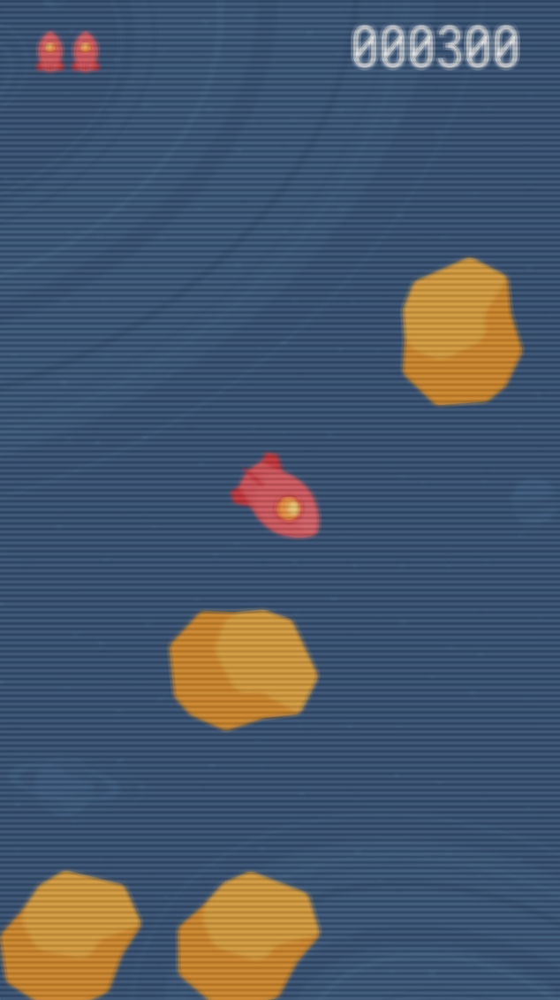
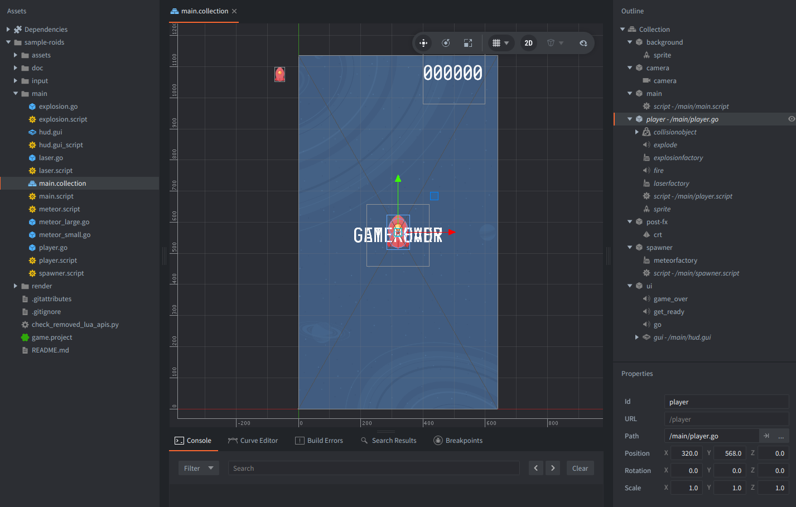

# Roids sample game

Welcome to the "Roids" sample game. This is a very simple "Asteroids" clone.

## Play the game

Select `Project`->`Build` (shortcut: <kbd>Ctrl</kbd>/<kbd>Cmd</kbd> + <kbd>B</kbd>) or [run it directly by clicking here](defold://project.build).

Turn the ship left and right with the <kbd>arrow keys</kbd> and fire at incoming meteors with <kbd>space</kbd>.

## Explore the sample

This sample shows how to assemble a simple Defold game from collections, game objects, components, scripts, factories, GUI scenes, collision objects, and a custom render script with post-processing effect of an old CRT screen.

The game starts (and it's also good to start exploring the project) with the [`game.project`](defold://open?path=/game.project). This file tells Defold which collection to load first, which render script to use, where the input bindings are, and what the default display size is. In this project it points to [`main/main.collection`](defold://open?path=/main/main.collection), [`render/roids.render`](defold://open?path=/render/roids.render), and [`input/game.input_binding`](defold://open?path=/input/game.input_binding). The display is set up as a portrait-style 640x1136 game.

The main scene is [`main.collection`](defold://open?path=/main/main.collection). A collection is a scene (or a "prefab") made from game object instances and their components. The main collection contains the player, a background sprite, the meteor spawner, the GUI, the main game controller, a camera, and a full-screen quad used by the post-processing effect. A useful first exercise is to open the collection and click each object in the `Outline` to see which components are attached to it.

Read more in [Project Settings manual](https://defold.com/manuals/project-settings/) and [Basic Building Blocks manual](https://defold.com/manuals/building-blocks/).

## How the game works

1. Defold reads [`game.project`](defold://open?path=/game.project).
2. It loads the bootstrap collection [`main.collection`](defold://open?path=/main/main.collection).
3. The `main` game object runs [`main.script`](defold://open?path=/main/main.script).
4. `main.script` initializes lives and score, hides the player, stops the spawner, and posts a `new_game` message to itself.
5. The `new_game` flow shows the "GET READY" GUI, waits briefly, and then sends messages that enable the player, start the spawner, and update the HUD.

This is a common Defold pattern: one object can coordinate the game by sending messages, while the other objects remain focused on their own jobs.

Read more about [Scripts here](https://defold.com/manuals/script/) and about [Message passing here](https://defold.com/manuals/message-passing).

## Main gameplay objects

- **Main** - main game object with [`main.script`](defold://open?path=/main/main.script) is the small game state machine. It does not move the player or create meteor physics itself. Instead, it decides when the round starts, when the player gets another try, when the game is over, and when the score changes. It "talks" to the player, spawner, and HUD using `msg.post()`.

- **Player** - [`player.go`](defold://open?path=/main/player.go) is the player ship game object. It has a script, a sprite, collision shapes, sounds, and two factories: one for lasers and one for explosions. [`player.script`](defold://open?path=/main/player.script) requests input focus when the player is active, reads the `left`, `right`, and `fire` actions, rotates the ship, switches the sprite animation between idle and thrust, and creates lasers with `factory.create()`.

- **Spawner** ([`spawner.script`](defold://open?path=/main/spawner.script)) creates meteors over time. It picks a position just outside the screen, aims roughly toward the player with a random offset, increases difficulty by raising meteor speed as more meteors spawn, and creates the meteor with a factory. It also keeps a table of live meteor ids so the playfield can be cleared after the player dies.

- **Meteors** - game objects [`meteor_large.go`](defold://open?path=/main/meteor_large.go) and [`meteor_small.go`](defold://open?path=/main/meteor_small.go) both use [`meteor.script`](defold://open?path=/main/meteor.script). The difference is data, not duplicated code: the small meteor overrides the `type` script property to `small`, while the large meteor keeps the default `large`. When a large meteor is hit, the shared script creates two small meteors using the factory embedded in the large meteor object.

- **Lasers** - game object [`laser.go`](defold://open?path=/main/laser.go) uses [`laser.script`](defold://open?path=/main/laser.script). A laser calculates its velocity from its rotation when it is created, moves forward every frame, deletes itself after traveling far enough, and also deletes itself on collision.

- **Explosions** - game object [`explosion.go`](defold://open?path=/main/explosion.go) uses [`explosion.script`](defold://open?path=/main/explosion.script). It plays the `explode` flipbook animation and deletes itself when the animation is completed.

Additionally, **input binding** ([`game.input_binding`](defold://open?path=/input/game.input_binding)) maps keys to action names. The player script does not check for raw keys directly; it checks for action ids such as `left`, `right`, and `fire`. This keeps controls separate from gameplay code.

## Messages

The sample uses **messages** for the communication:

* `main.script` sends `go`, `hide`, `run`, `stop`, `delete_all`, `get_ready`, `game_over`, `set_lives`, and `set_score` messages.
* The player sends `player_dies` to `main.script` after colliding with a meteor.
* Meteors send `meteor_created` and `meteor_destroyed` to the spawner so it can maintain its live meteor list.
* Meteors also send `meteor_destroyed` to `main.script` so the score can increase.

Read more in the manuals: [Addressing](https://defold.com/manuals/addressing/) and [Message passing](https://defold.com/manuals/message-passing).

## Collisions

Collision objects are attached to the player, lasers, and meteors. Their collision groups and masks decide what can collide and with which other group - player objects collide with meteors, lasers collide with meteors, and meteors listen for both player and laser hits. When Defold detects a collision, scripts receive a `collision_response` message and decide what to do next.

Read more in the manuals: [Physics](https://defold.com/manuals/physics/), [Collision objects](https://defold.com/manuals/physics-objects/), [Collision messages](https://defold.com/manuals/physics-messages/).

## GUI

[`hud.gui`](defold://open?path=/main/hud.gui) contains the score text, "GET READY", "GAME OVER", and a life icon template. [`hud.gui_script`](defold://open?path=/main/hud.gui_script) hides and shows nodes, formats the score with leading zeroes, clones the life icon for each remaining life, and plays UI sounds.

Find more details in the [GUI manual](https://defold.com/manuals/gui/),

## Animations

The atlas [`assets/sprites.atlas`](defold://open?path=/assets/sprites.atlas) has the game images and defines animations such as `ship_idle`, `ship_thrust`, `laser`, and `explode`. Scripts switch sprite animations with `sprite.play_flipbook()`, while GUI nodes reference atlas images such as the life icon.

Read more details in the [Atlas](https://defold.com/manuals/atlas/), and [Sprites](https://defold.com/manuals/sprite/) manuals.

## Rendering and post-processing

This project uses a custom render pipeline: [`render/roids.render`](defold://open?path=/render/roids.render) with a [`render/roids.render_script`](defold://open?path=/render/roids.render_script).

The render script creates an off-screen render target, draws the tile sprites, particles, debug graphics, GUI, and text into that target, then switches back to the default. It then draws a full-screen quad from `main.collection` using [`render/crt.material`](defold://open?path=/render/crt.material). The material uses special shaders: [`render/crt.vp`](defold://open?path=/render/crt.vp) and [`render/crt.fp`](defold://open?path=/render/crt.fp) to blur the rendered image slightly and add CRT-like scanlines.

This is common for screen-space post-processing effects: first render the game to a separate texture (a render target), then render that texture to the screen with a shader.

Read more about rendering and shaders in the manuals: [Render](https://defold.com/manuals/render/), [Materials](https://defold.com/manuals/material/) and [Shaders](https://defold.com/manuals/shader/).

## Shooting and destroying meteors - game logic

1. Pressing <kbd>space</kbd> is mapped to `fire` in [`input/game.input_binding`](defold://open?path=/input/game.input_binding).
2. [`player.script`](defold://open?path=/main/player.script) receives that action in `on_input()`.
3. The player script plays a sound and creates [`laser.go`](defold://open?path=/main/laser.go) with `factory.create()`.
4. [`laser.script`](defold://open?path=/main/laser.script) moves the laser forward every frame.
5. If the laser hits a meteor, both objects receive `collision_response`.
6. [`meteor.script`](defold://open?path=/main/meteor.script) deletes the meteor, tells [`main.script`](defold://open?path=/main/main.script) to add score, and may spawn smaller meteors.
7. [`main.script`](defold://open?path=/main/main.script) sends `set_score` to [`hud.gui_script`](defold://open?path=/main/hud.gui_script).
8. The HUD script updates the score text in [`hud.gui`](defold://open?path=/main/hud.gui).

Read more about using [Factories here](https://defold.com/manuals/factory).

## Small Exercises

1. Change the controls in [`input/game.input_binding`](defold://open?path=/input/game.input_binding). This teaches how input actions are named before scripts use them. Maybe add `A`,`D` for actions `left` and `right` respectively or a gamepad support.
2. Change the number of starting lives in [`main.script`](defold://open?path=/main/main.script). Look for the line with initial lives definition.
3. Change the points awarded for each meteor in [`main.script`](defold://open?path=/main/main.script). Look for the `meteor_destroyed` message handler.
4. Make lasers faster or slower in [`laser.script`](defold://open?path=/main/laser.script). Look for a coressponding variable.
5. Make lasers range longer in [`laser.script`](defold://open?path=/main/laser.script). Check when object is deleted.
6. Make meteors spawn more or less often in [`spawner.script`](defold://open?path=/main/spawner.script). Look at the `nextspawn()` function.
7. Make the game get harder faster in [`spawner.script`](defold://open?path=/main/spawner.script). Look at how `self.count` affects meteor velocity.
8. Change what happens when a large meteor is destroyed in [`meteor.script`](defold://open?path=/main/meteor.script). The split behavior is inside the `self.type == hash("large")` branch.
9. Edit the score or lives layout in [`hud.gui`](defold://open?path=/main/hud.gui), then read [`hud.gui_script`](defold://open?path=/main/hud.gui_script) to see how those nodes are changed at runtime.
10. Adjust the CRT effect in [`render/crt.fp`](defold://open?path=/render/crt.fp). The blur and scanline functions are meant to experiment with.

## Larger exercises

1. Add a start screen. Add a new state in `main.script`, show a GUI prompt in `hud.gui`, and only send `go` and `run` after the player presses a start action. If it's your first time doing adding screen transitions, check the [Colorslide tutorial](https://defold.com/tutorials/colorslide/) or the [Collection Proxy manual](https://defold.com/manuals/collection-proxy/).
2. Add a high score. Store the best score in `main.script`, update it when the player dies, and add another text node in `hud.gui` to display it.
3. Add touch/mouse controls. Add touch/mouse input bindings, GUI buttons and then handle those actions.
4. Add powerups. Create a new game object with visual sprite, and a collision object components, spawn it with a factory randomly on meteor destruction, and make the player collision object detect it and handle what happens on collision.
5. Add a new meteor type. Create another meteor game object that uses `meteor.script` with different properties, sprite, collision shape, or split behavior.

Check out [the Learn Hub website](https://defold.com/learn) for more examples, tutorials, manuals and API docs.

If you run into trouble, help is available in [our forum](https://forum.defold.com).

Happy Defolding!

----

# License

This project is released under the **Creative Commons CC0 1.0 Universal license**.

You’re free to use these assets in any project, personal or commercial. There’s no need to ask permission before using these. Giving attribution is not required, but is greatly appreciated!
[Full license text](https://creativecommons.org/publicdomain/zero/1.0)

Defold Foundation
